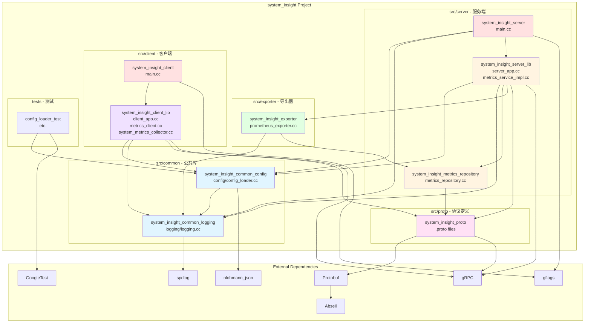

# System Insight 架构文档

## 1. 模块关系图

```mermaid
graph TB
    subgraph "External Dependencies"
        GRPC[gRPC]
        PROTOBUF[Protobuf]
        SPDLOG[spdlog]
        GFLAGS[gflags]
        JSON[nlohmann_json]
        GTEST[GoogleTest]
        ABSL[Abseil]
    end

    subgraph "system_insight Project"
        subgraph "src/common - 公共库"
            COMMON_LOGGING[system_insight_common_logging<br/>logging/logging.cc]
            COMMON_CONFIG[system_insight_common_config<br/>config/config_loader.cc]
        end

        subgraph "src/proto - 协议定义"
            PROTO[system_insight_proto<br/>.proto files]
        end

        subgraph "src/server - 服务端"
            SERVER_REPO[system_insight_metrics_repository<br/>metrics_repository.cc]
            SERVER_LIB[system_insight_server_lib<br/>server_app.cc<br/>metrics_service_impl.cc]
            SERVER_EXE[system_insight_server<br/>main.cc]
        end

        subgraph "src/exporter - 导出器"
            EXPORTER[system_insight_exporter<br/>prometheus_exporter.cc]
        end

        subgraph "src/client - 客户端"
            CLIENT_LIB[system_insight_client_lib<br/>client_app.cc<br/>metrics_client.cc<br/>system_metrics_collector.cc]
            CLIENT_EXE[system_insight_client<br/>main.cc]
        end

        subgraph "tests - 测试"
            TESTS[config_loader_test<br/>etc.]
        end
    end

    %% Common dependencies
    COMMON_LOGGING --> SPDLOG
    COMMON_CONFIG --> COMMON_LOGGING
    COMMON_CONFIG --> JSON

    %% Proto dependencies
    PROTO --> PROTOBUF
    PROTO --> GRPC

    %% Server dependencies
    SERVER_REPO --> PROTO
    SERVER_LIB --> COMMON_CONFIG
    SERVER_LIB --> COMMON_LOGGING
    SERVER_LIB --> SERVER_REPO
    SERVER_LIB --> EXPORTER
    SERVER_LIB --> PROTO
    SERVER_LIB --> GRPC
    SERVER_EXE --> COMMON_CONFIG
    SERVER_EXE --> COMMON_LOGGING
    SERVER_EXE --> SERVER_LIB
    SERVER_EXE --> GFLAGS

    %% Exporter dependencies
    EXPORTER --> COMMON_LOGGING
    EXPORTER --> SERVER_REPO

    %% Client dependencies
    CLIENT_LIB --> COMMON_CONFIG
    CLIENT_LIB --> COMMON_LOGGING
    CLIENT_LIB --> PROTO
    CLIENT_LIB --> GRPC
    CLIENT_EXE --> CLIENT_LIB
    CLIENT_EXE --> GFLAGS

    %% Test dependencies
    TESTS --> COMMON_CONFIG
    TESTS --> GTEST

    %% Protobuf dependencies
    PROTOBUF --> ABSL

    style COMMON_LOGGING fill:#e1f5ff
    style COMMON_CONFIG fill:#e1f5ff
    style SERVER_REPO fill:#fff4e1
    style SERVER_LIB fill:#fff4e1
    style SERVER_EXE fill:#ffe1e1
    style EXPORTER fill:#e1ffe1
    style CLIENT_LIB fill:#f0e1ff
    style CLIENT_EXE fill:#ffe1e1
    style PROTO fill:#ffe1f5
```

## 2. 数据流向图

```mermaid
flowchart LR
    subgraph CLIENT["Client Container"]
        direction TB
        COLLECTOR[SystemMetricsCollector<br/>读取 /proc]
        CLIENT_APP[system_insight_client<br/>:50052]
        COLLECTOR --> CLIENT_APP
    end

    subgraph SERVER["Server Container"]
        direction TB
        SERVER_APP[system_insight_server<br/>:50052 gRPC]
        REPO[MetricsRepository<br/>内存存储]
        EXPORTER[PrometheusExporter<br/>:9102 HTTP]
        SERVER_APP --> REPO
        REPO --> EXPORTER
    end

    subgraph PROM["Prometheus Container"]
        PROMETHEUS[Prometheus<br/>:9090<br/>时间序列数据库]
    end

    subgraph GRAF["Grafana Container"]
        GRAFANA[Grafana<br/>:3000<br/>可视化平台]
    end

    CLIENT_APP -->|gRPC SendMetrics<br/>:50052| SERVER_APP
    EXPORTER -->|HTTP GET /metrics<br/>:9102| PROMETHEUS
    PROMETHEUS -->|PromQL API<br/>:9090| GRAFANA

    style CLIENT fill:#f0e1ff,stroke:#333,stroke-width:2px
    style SERVER fill:#fff4e1,stroke:#333,stroke-width:2px
    style PROM fill:#ffe1f5,stroke:#333,stroke-width:2px
    style GRAF fill:#e1f5ff,stroke:#333,stroke-width:2px
    style COLLECTOR fill:#e8d5ff
    style CLIENT_APP fill:#d4b3ff
    style SERVER_APP fill:#ffe8cc
    style REPO fill:#ffd699
    style EXPORTER fill:#ccffcc
    style PROMETHEUS fill:#ffccdd
    style GRAFANA fill:#cce5ff
```