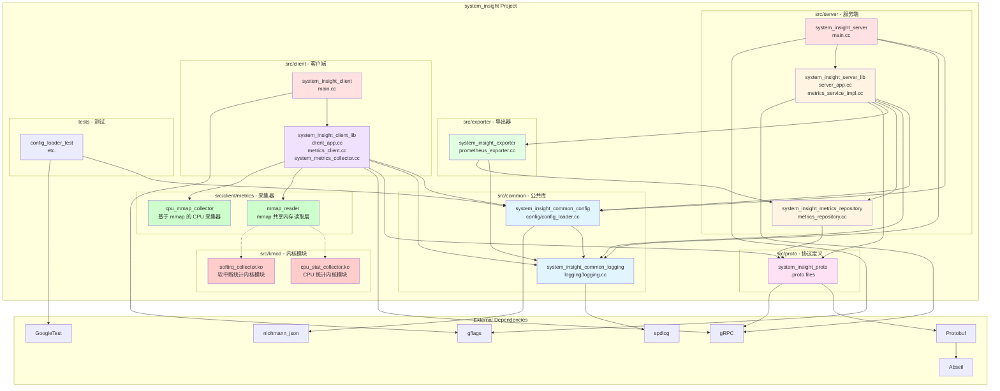

# System Insight 架构文档

## 1. 模块关系图



## 2. 数据流向图

```mermaid
flowchart LR
    subgraph CLIENT["Client Container"]
        direction TB
        subgraph COLLECTOR["SystemMetricsCollector"]
            direction LR
            MMAP["mmap_reader<br/>mmap 模式"] --> CPU["cpu_mmap_collector"]
            PROC["/proc/* 读取<br/>回退模式"]
        end
        CLIENT_APP[system_insight_client<br/>:50052]
        COLLECTOR --> CLIENT_APP
    end

    subgraph SERVER["Server Container"]
        direction TB
        SERVER_APP[system_insight_server<br/>:50052 gRPC]
        REPO[MetricsRepository<br/>内存存储]
        EXPORTER[PrometheusExporter<br/>:9102 HTTP]
        SERVER_APP --> REPO
        REPO --> EXPORTER
    end

    subgraph PROM["Prometheus Container"]
        PROMETHEUS[Prometheus<br/>:9090<br/>时间序列数据库]
    end

    subgraph GRAF["Grafana Container"]
        GRAFANA[Grafana<br/>:3000<br/>可视化平台]
    end

    subgraph KERNEL["Kernel Space"]
        KMOD_CPU[/dev/system_insight_cpu_stat]
        KMOD_SOFTIRQ[/dev/system_insight_softirq]
    end

    COLLECTOR -.->|mmap| KMOD_CPU
    COLLECTOR -.->|mmap| KMOD_SOFTIRQ
    CLIENT_APP -->|gRPC SendMetrics<br/>:50052| SERVER_APP
    EXPORTER -->|HTTP GET /metrics<br/>:9102| PROMETHEUS
    PROMETHEUS -->|PromQL API<br/>:9090| GRAFANA

    style CLIENT fill:#f0e1ff,stroke:#333,stroke-width:2px
    style SERVER fill:#fff4e1,stroke:#333,stroke-width:2px
    style PROM fill:#ffe1f5,stroke:#333,stroke-width:2px
    style GRAF fill:#e1f5ff,stroke:#333,stroke-width:2px
    style KERNEL fill:#ffcccc,stroke:#333,stroke-width:2px
    style COLLECTOR fill:#ccffcc,stroke:#333,stroke-width:2px
    style MMAP fill:#ccffcc
    style CPU fill:#ccffcc
    style PROC fill:#ffffcc
    style CLIENT_APP fill:#d4b3ff
    style SERVER_APP fill:#ffe8cc
    style REPO fill:#ffd699
    style EXPORTER fill:#ccffcc
    style PROMETHEUS fill:#ffccdd
    style GRAFANA fill:#cce5ff
```

## 3. 采集模式说明

### 3.1 mmap 模式（高性能）

当内核模块加载时，采集器使用 mmap 直接读取内核共享内存：

- **cpu_stat_collector.ko**: 提供 `/dev/system_insight_cpu_stat` 设备
  - 每秒从内核 `kcpustat_cpu()` 读取 per-CPU 统计
  - 通过 mmap 零拷贝暴露给用户空间
  - 包含：user, nice, system, idle, iowait, irq, softirq, steal, guest, guest_nice

- **softirq_collector.ko**: 提供 `/dev/system_insight_softirq` 设备
  - 每秒从内核 `kstat_softirqs_cpu()` 读取软中断统计
  - 通过 mmap 零拷贝暴露给用户空间
  - 包含：HI, TIMER, NET_TX, NET_RX, BLOCK, IRQ_POLL, TASKLET, SCHED, HRTIMER, RCU

### 3.2 /proc 模式（回退兼容）

当内核模块不可用时，自动回退到读取 `/proc/*` 文件系统：

- `/proc/stat`: CPU 时间统计
- `/proc/meminfo`: 内存使用情况
- `/proc/net/dev`: 网络接口统计

## 4. 采集指标列表

| 指标名称 | 来源 | 说明 |
|---------|------|------|
| `system.cpu.usage_percent` | mmap/proc | 整体 CPU 使用率 |
| `system.cpu.core.usage_percent` | mmap | per-CPU 核心使用率 (label: core) |
| `system.softirq.*_per_sec` | mmap | 各类软中断速率 |
| `system.mem.usage_percent` | /proc | 内存使用率 |
| `system.mem.available_bytes` | /proc | 可用内存 |
| `system.net.rx_bytes_per_sec` | /proc | 网络接收速率 |
| `system.net.tx_bytes_per_sec` | /proc | 网络发送速率 |
